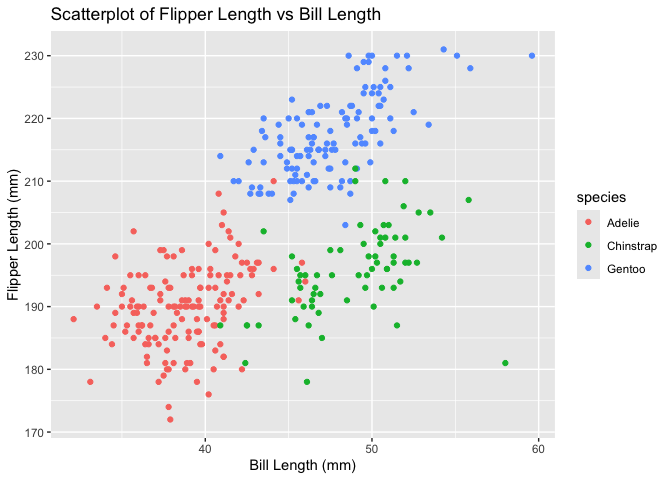

p8105_hw1_iah2124
================
Iris Hart
2024-09-20

## Homework 1

## Problem 0.2

Loading the penguin data sets

``` r
data("penguins", package = "palmerpenguins")
```

## Problem 1

Loading tidyverse package - includes dplyr for data manipulation

``` r
library(tidyverse)
```

    ## ── Attaching core tidyverse packages ──────────────────────── tidyverse 2.0.0 ──
    ## ✔ dplyr     1.1.4     ✔ readr     2.1.5
    ## ✔ forcats   1.0.0     ✔ stringr   1.5.1
    ## ✔ ggplot2   3.5.1     ✔ tibble    3.2.1
    ## ✔ lubridate 1.9.3     ✔ tidyr     1.3.1
    ## ✔ purrr     1.0.2     
    ## ── Conflicts ────────────────────────────────────────── tidyverse_conflicts() ──
    ## ✖ dplyr::filter() masks stats::filter()
    ## ✖ dplyr::lag()    masks stats::lag()
    ## ℹ Use the conflicted package (<http://conflicted.r-lib.org/>) to force all conflicts to become errors

Viewing the dataset

``` r
view(penguins)
```

Size of the dataset

``` r
num_rows = nrow(penguins)
num_cols = ncol(penguins)
```

Finding the mean flipper length from the penguins data set, excluding
any missing values

``` r
mean(penguins[["flipper_length_mm"]], na.rm = TRUE)
```

    ## [1] 200.9152

This data set contains information about penguins including the species,
which island they are from, bill length(mm), bill depth(mm), flipper
length(mm), body mass(g), sex, and year. There are 344 observations in
the data set, with 8 variables. The mean flipper length is 200.92mm.

loading ggplot to make a scatter plot

``` r
library(ggplot2)
```

Creating a scatter plot of flipper length vs bill length

``` r
ggplot(data = penguins, aes(x = bill_length_mm, y = flipper_length_mm, color = species)) +
  geom_point() +
  labs(x = "Bill Length (mm)", y = "Flipper Length (mm)", title = "Scatterplot of Flipper Length vs Bill Length")
```

    ## Warning: Removed 2 rows containing missing values or values outside the scale range
    ## (`geom_point()`).

<!-- -->

Saving the scatter plot

``` r
ggsave("penguins_scatterplot.png")
```

    ## Saving 7 x 5 in image

    ## Warning: Removed 2 rows containing missing values or values outside the scale range
    ## (`geom_point()`).

## Problem 2

Creating a data frame

``` r
df = data.frame(
  sample_normal = rnorm(10),
  logical_vec = rnorm(10)>0, 
  char_vec = sample(letters, 10, replace = TRUE),
  factor_vec = factor(sample(c("A", "B", "C"), 10, replace = TRUE))
)
```

Viewing the data frame

``` r
view(df)
```

Means of each variable

``` r
mean(df %>% pull(sample_normal))
```

    ## [1] -0.4494309

``` r
mean(df %>% pull(logical_vec))  
```

    ## [1] 0.4

``` r
mean(df %>% pull(char_vec))
```

    ## Warning in mean.default(df %>% pull(char_vec)): argument is not numeric or
    ## logical: returning NA

    ## [1] NA

``` r
mean(df %>% pull(factor_vec))
```

    ## Warning in mean.default(df %>% pull(factor_vec)): argument is not numeric or
    ## logical: returning NA

    ## [1] NA

You can find the mean of the data frame sample, you can also find the
mean of the logical vector. These variables are numeric or logical(true
valued at 1 and false values at 0), indicating that a mean value can be
calculated. For the variables character vector and factor vector, no
mean can be calculated. This is because these variables are neither
numeric or logical.

Explicitly convert variables from one type to another

``` r
mean_logical = mean(df %>% pull(logical_vec) %>% as.numeric(), na.rm = TRUE)
mean_char = mean(df %>% pull(char_vec) %>% as.numeric(), na.rm = TRUE)
mean_factor = mean(df %>% pull(factor_vec) %>% as.numeric(), na.rm = TRUE)
```

You can now take the mean of the logical and factor variables as the
converting was able to assign numeric values to the logical and factor
variables. However, for the character variable you can not take the mean
since no numeric value can be assigned. The output you get for the
character vector is NA since it can’t be changed to numeric.
